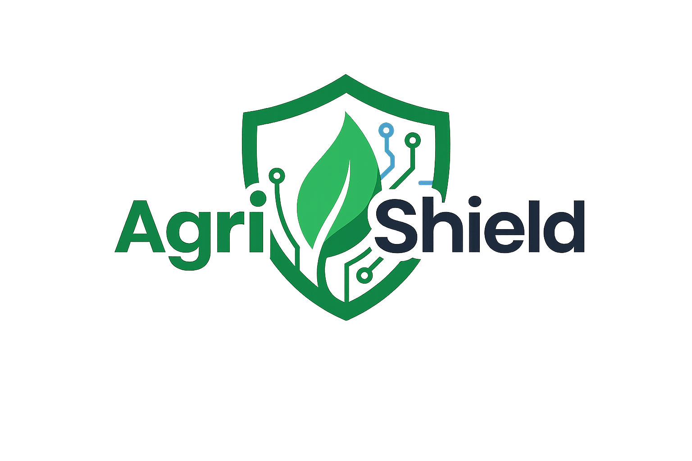

<div align="center">



# 🌱 AgriShield

### AI-Powered Heavy Metal Risk Assessment & Decision Support System for Sustainable Agriculture

</div>

---

## 📖 Overview

AgriShield is an AI-powered web platform for assessing heavy metal contamination in agricultural soil. It combines internationally accepted pollution indices, bioavailability estimation, food safety evaluation, human health risk assessment, AI-generated recommendations, and interactive visualizations into a single intelligent decision support system.

The platform is designed to assist **farmers, researchers, environmental scientists, students, and policymakers** in making informed and sustainable agricultural decisions.

---

## ✨ Features

- 🌍 Heavy Metal Contamination Assessment
- 📊 Scientific Pollution Indices (CF, Igeo, EF, Er, PLI, NPI & PERI)
- 🌱 Bioavailability Analysis
- 🍅 Food Safety Evaluation
- ❤️ Human Health Risk Assessment (Adult & Child)
- 🤖 AI-Powered Assessment Summary & Recommendations (Google Gemini)
- 📈 Interactive Dashboard with Charts
- 📄 Professional PDF Report Generation
- 📚 Knowledge Hub with Educational Articles
- 📖 Comprehensive Technical Documentation
- 🌙 Fully Responsive Light/Dark Theme

---

## 🛠 Tech Stack

### Frontend

- Next.js
- React
- TypeScript
- Tailwind CSS
- React Markdown
- Recharts

### Backend

- FastAPI
- Python
- Pydantic

### Database

- SQLite

### AI & Data Processing

- Google Gemini API
- Pandas
- NumPy
- Scikit-learn

---

## 🚀 Getting Started

### Clone Repository

```bash
git clone https://github.com/aggarwalkamal123/Agrishield.git

cd Agrishield
```

### Frontend

```bash
cd frontend

npm install

npm run dev
```

Frontend:

```
http://localhost:3000
```

---

### Backend

```bash
cd backend

python -m venv venv

venv\Scripts\activate

pip install -r requirements.txt

uvicorn app.main:app --reload
```

Backend:

```
http://127.0.0.1:8000
```

---

### API Documentation

Swagger UI

```
http://127.0.0.1:8000/docs
```

---

## 🎯 Core Modules

- Heavy Metal Assessment
- Pollution Indices Calculation
- Bioavailability Estimation
- Food Safety Analysis
- Human Health Risk Assessment
- AI Recommendation Engine
- Interactive Dashboard
- Knowledge Hub
- Documentation Portal
- PDF Report Generator

---

## 🌍 Vision

AgriShield bridges **Artificial Intelligence**, **Environmental Science**, and **Sustainable Agriculture** by providing an intelligent, reliable, and user-friendly platform for heavy metal contamination assessment and informed agricultural decision-making.

---

<div align="center">

### 🌱 AgriShield

**AI for Sustainable Agriculture**

Made with ❤️ using **Next.js**, **FastAPI**, and **Google Gemini AI**

</div>